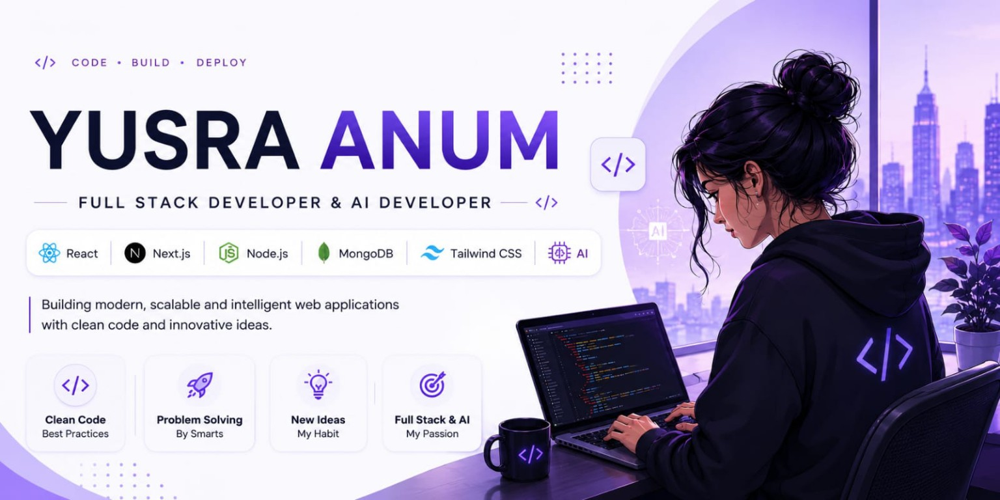

  

  

  

<h3 align="center">
🚀 Full Stack Developer | 🤖 AI Developer | 💡 Problem Solver
</h3>

Building modern, scalable and AI-powered applications that solve real-world problems.

---

## 👩‍💻 About Me

- 🔭 Currently working on Full Stack & AI Projects
- 🌱 Learning Advanced AI Integration & System Design
- 🤖 Exploring AI Agents & Automation
- 💡 Passionate about solving real-world problems through technology
- 🎯 Goal: Become a Top Full Stack & AI Engineer
- ⚡ Fun Fact: Consistency beats talent

---

## 🚀 Tech Stack

### Frontend

  

### Backend

  

### AI & Programming

  

### Tools

  

---

## 📊 GitHub Analytics

  

  

---

## 🔥 GitHub Streak

  

---

## 🏆 GitHub Trophies

  

---

## 🌟 Featured Projects

### 🤖 AI Chat Assistant
AI-powered chatbot using OpenAI APIs and modern web technologies.

### 🛒 Full Stack E-Commerce Platform
Modern shopping platform with authentication, payments and admin dashboard.

### 📚 Learning Management System
Educational platform with student and instructor dashboards.

### 💼 Portfolio Website
Personal portfolio showcasing projects, skills and achievements.

---

## 📈 Contribution Graph

  

---

  

## 🌐 Connect With Me

---

<h3 align="center">
✨ Always Learning • Always Building • Always Growing ✨
</h3>

